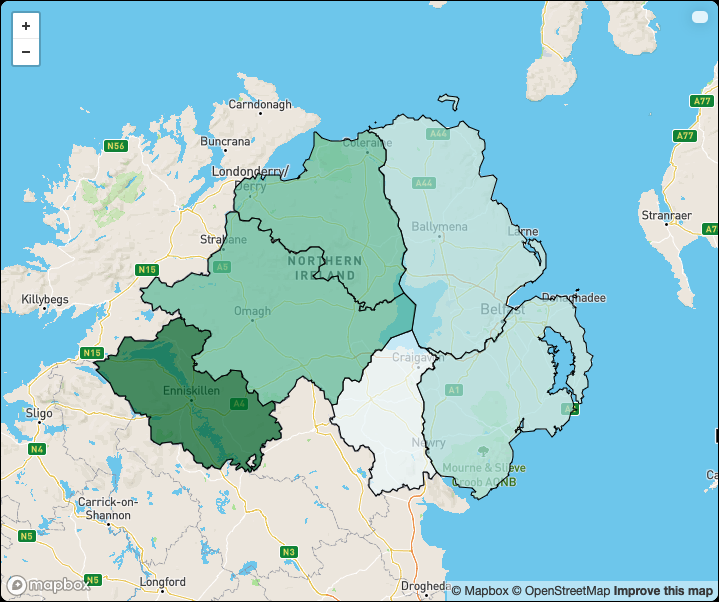

ni-forests
----------

A small and simple application written during [COP26](https://ukcop26.org/) to learn more about forests/habitats in Northern Ireland. It is [available online](https://patricoferris.github.io/ni-forests/) and there's a more accessible, low-bandwidth [text version too](https://patricoferris.github.io/ni-forests/text.html).

## Technology

Of course it's written in OCaml. More specifically:

 - A branch of [lwd](https://github.com/let-def/lwd/tree/brr-lwd) with [brr][] support.
 - Some bindings are written for [leaflet](https://leafletjs.com/) (and mapbox), again with [brr][]. The bindings could be a lot better.
 - A [ppx for generating brr code](https://github.com/patricoferris/ppx_deriving_brr) from types (it's an experiment, I don't know if I like it or not yet).
 - The ever reliable [omd](https://github.com/ocaml/omd) does the markdown to HTML conversion.
 - There's a bit of `npm + tailwind` to generates the CSS bundle.

[brr]: https://erratique.ch/software/brr